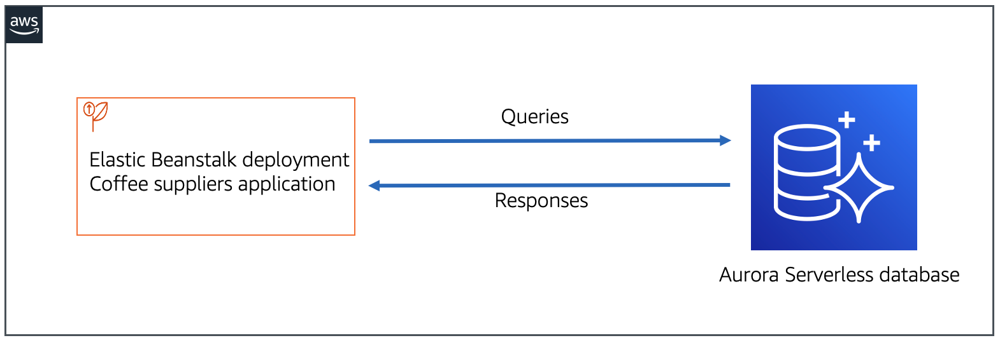
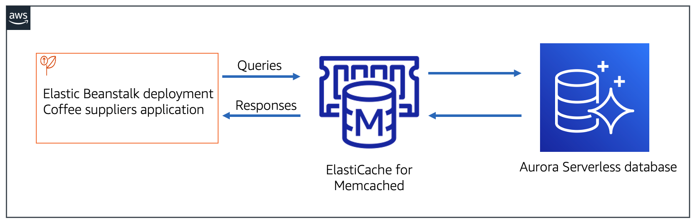

# Caching Application Data with ElastiCache

## Objectives:

* Create a new ElastiCache for Memcached cluster
* Query the ElastiCache for Memcached cluster by using Python and the pymemcache client

## Lab initial time

## Lab completed
